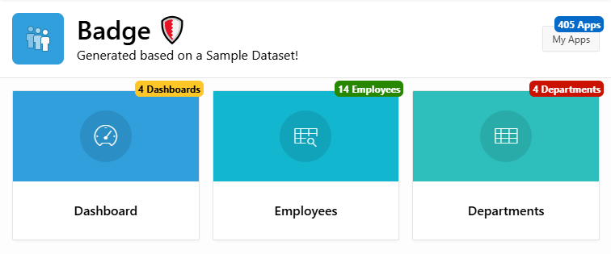

# Pretius APEX Badge

  

- [What is the Pretius APEX Badge Plugin](#what-is-the-pretius-apex-badge-plugin)
- [Release History](#release-history)
- [Plugin Installation Quick-Start](#plugin-installation-quick-start)
- [Quick-Tutorial](#quick-tutorial)
- [Cookbook](#cookbook)
- [Settings](#settings)
- [Troubleshooting](#troubleshooting)
- [Future Developments](#future-developments)
- [Advanced Installation](#advanced-installation)
- [License](#license)
- [Free Support](#free-support)
- [Bug Reporting and Change Requests](#bug-reporting-and-change-requests)
- [Implementation Issues](#implementation-issues)
- [Become a Contributor](#become-a-contributor)
- [Commercial Support](#commercial-support)

Pretius APEX Badge is an Oracle APEX plugin developed by [Matt Mulvaney](https://www.twitter.com/Matt_Mulvaney) at [Pretius](https://www.pretius.com). 

This Plugin allows the creation and display of refreshable Badge notifications aligned to APEX Page Elements

 

# Demo

[Link](https://apex.oracle.com/pls/apex/r/luf/BADGE-%EF%B8%8F102/home)

# Release History
24.2.0 : Initial Version

# Plugin Installation Quick-Start

Minimum Version of APEX Required: **21.2.0**

Import the plugin into your application from this location:

`plugin\dynamic_action_plugin_com_pretius_apex_badge.sql`

# Quick-Tutorial

This Quick-Tutorial added an APEX Application Count badge to a button called 'MY_APPS'
1. Create a Page Load Dynamic Action
2. Set the true action to **Pretius APEX Badge [Plug-in]**
Use the table

| Name              | Value                                    |
|-------------------|------------------------------------------|
| Set Type          | SQL                                      |
| SQL Query         | SELECT COUNT(*) \|\| ' Apps' x FROM APEX_APPLICATIONS   |
| Custom Attributes | title="Number of Workspace Applications" |
| Selection Type    | Button                                   |
| Button            | MY_APPS                                  |

# Cookbook 

## RDS
To add Badges to RDS tabs, set the following

| Name              | Value                                    |
|-------------------|------------------------------------------|
| Selection Type    | jQuery Selector                                   |
| jQuery Selector            | #**static_id_of_rds**_tab                                  |

## Cards

As in the picture above. 

Dynamic Action: After Region Refresh

| Name              | Value                                    |
|-------------------|------------------------------------------|
| Selection Type    | JavaScript Expression                                  |
| JavaScript Expression            | $('.t-Card:has(h3:contains("**Employees**"))')       

# Settings:

## Set Type:
* JavaScript Expression: e.g. 'Hello World'
* SQL Query: e.g SELECT 'Hello World' FROM DUAL
* PL/SQL Expression: e.g apex_string.join(apex_t_varchar2('Hello', 'World'),' ')
* PL/SQL Function e.g RETURN apex_string.format('%0 %1', 'Hello', 'World');

## Items to Submit
* Comma Delimited Page Item to submit in to session for PL/SQL Expressions/Functions

## Escape Special Characters
* Set Escape Special Characters to No to allow HTML in the Badge

## Show Spinner
* Spinner can be useful as a visual clue to the user that a value is loading. This is especially helpful when the badge requires refreshing following a dialog close or a timer/web sockets event.

## Show Zero:
* If No, then if the value equates to zero then the badge will not be shown. If Yes, the badge will show zero. Null labels never show the badge

## CSS Classes:

* Any CSS classes to style the badge. This defaults to u-hot which is one of the Universal Theme Color Modifier Classes from https://apex.oracle.com/ut/

* You can additonally add the **notification-badge-show-top** class to bubble the badge to the top
Examples

   * u-color-X (where X is between 1 and 45 e.g u-color-9 or u-color-10)
   * u-normal
   * u-hot
   * u-warning
   * u-danger
   * u-info
   * u-success

## Custom Attributes: 
* Any custom attributes e.g mysession="&SESSION."

## Element Attachment:
* Some Badges have scroll or placement issues with different positions of APEX elements.
* Use **Element** for Widget based components such as Navigation Menus, Breadcrumbs and Interactive Grid Columns.

## Horizontal Position

* Fine Tuning of the Horizontal Position to nudge the badge left/right. The default is 5, which hangs the badge just over the right hand edge of the element. Choose a lower (or negative number) to nudge it to the left or a higher/positive number to nudge it to the right.

## Vertical Position

* Fine Tuning of the Horizontal Position to nudge the badge up/down. The default is 0, which hangs the badge just over the top edge of the element. Choose a lower (or negative number) to nudge it upwards or a higher/positive number to nudge it downwards.

## Link
* URL to load when clicked

# Troubleshooting

## Badge not Showing
If a Badge does not show, try:
1. Experimenting with the **Element Attachment** setting
2. Adjust the Vertical/Horizontal fine-tuning. 
3. Add the **notification-badge-show-top** class to the **CSS Classes** section

## Scrolling Issues
If you see the Badge bouncing whilst scrolling, try:
1. Seelct **Element** for the **Element Attachment** setting. This works best with Widget based components such as Navigation Menus, Breadcrumbs and Interactive Grid Columns.

# Future developments
Please let me know any of your wishes

# Advanced Installation

## Web Server Installation (Optional)
1. Place the JavaScript & CSS files from plugin\server on your web server.

2. Create an Application Substitution (Recommended), Application Item or Global Page Item with the following properties:
   * Name: <code>APP_PRETIUS_NOTIF_CTR_SRV</code>
   * Value: URL e.g., <code>http://127.0.0.1:8889/</code> or <code>#IMAGE_PREFIX#</code>

   *Don't forget the final slash (/) on the end of the URL*

## DB Installation (Optional)
1. Compile the **pkg_com_pretius_apex_devtool** package spec & body from plugin\db

2. Create an Application Substitution (Recommended), Application Item or Global Page Item as:
   * Name: <code>APP_PRETIUS_NOTIF_CTR_PKG</code>
   * Value: <code>pkg_com_pretius_apex_badge.</code>

   *Don't forget the final dot (.) on the end of the value*

## License

Licensed under the [MIT](LICENSE) license.

This project incorporates code from the following open-source project:

- Project jQuery Badge plugin: https://doc.wikimedia.org/mediawiki-core/1.23.14/js/source/jquery.badge.html
  License: MIT License (full text available at the link above)

## Free support
Pretius provides free support for the plugins at the GitHub platform. 
We monitor raised issues, prepare fixes, and answer your questions. However, please note that we deliver the plug-ins free of charge, and therefore we will not always be able to help you immediately. 

Interested in better support? 
* [Become a contributor!](#become-a-contributor) We always prioritize the issues raised by our contributors and fix them for free.
* [Consider comercial support.](#commercial-support) Options and benefits are described in the chapter below.

### Bug reporting and change requests
Have you found a bug or have an idea of additional features that the plugin could cover? Firstly, please check the Roadmap and Known issues sections. If your case is not on the lists, please open an issue on a GitHub page following these rules:
* issue should contain login credentials to the application at apex.oracle.com where the problem is reproduced;
* issue should include steps to reproduce the case in the demo application;
* issue should contain description about its nature.

### Implementation issues
If you encounter a problem during the plug-in implementation, please check out our demo application. We do our best to describe each possible use case precisely. If you can not find a solution or your problem is different, contact us: apex-plugins@pretius.com.

## Become a contributor!
We consider our plugins as genuine open source products, and we encourage you to become a contributor. Help us improve plugins by fixing bugs and developing extra features. Comment one of the opened issues or register a new one, to let others know what you are working on. When you finish, create a new pull request. We will review your code and add the changes to the repository.

By contributing to this repository, you help to build a strong APEX community. We will prioritize any issues raised by you in this and any other plugins.

## Commercial support
We are happy to share our experience for free, but we also realize that sometimes response time, quick implementation, SLA, and instant release for the latest version are crucial. That’s why if you need extended support for our plug-ins, please contact us at apex-plugins@pretius.com.
We offer:
* enterprise-level assistance;
* support in plug-ins implementation and utilization;
* dedicated contact channel to our developers;
* SLA at the level your organization require;
* priority update to next APEX releases and features listed in the roadmap.